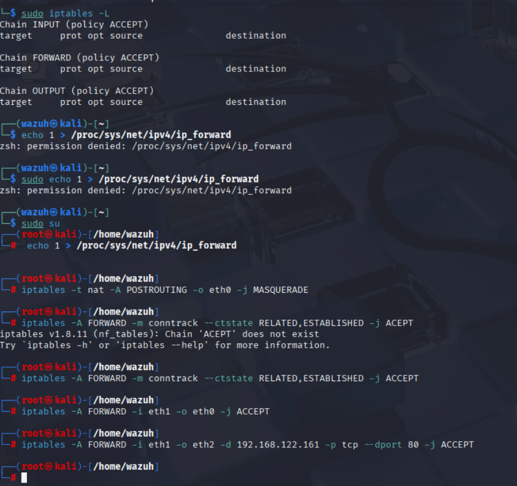
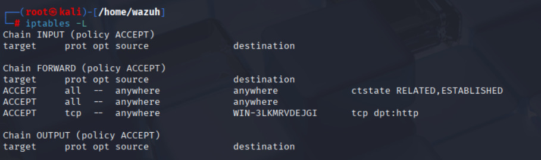
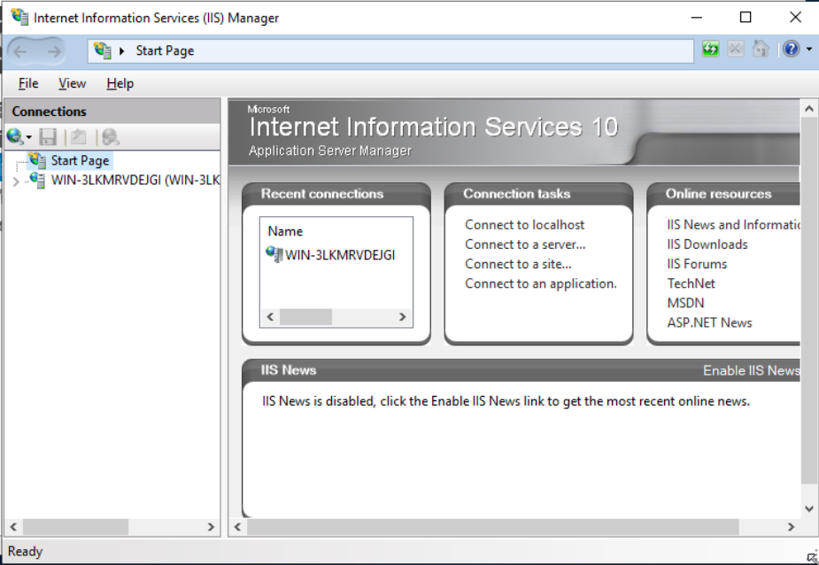
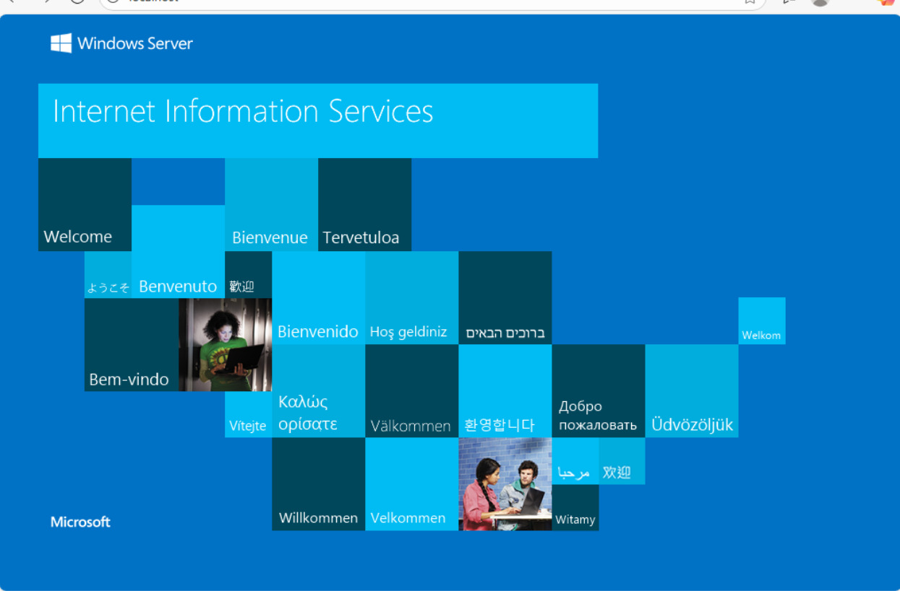
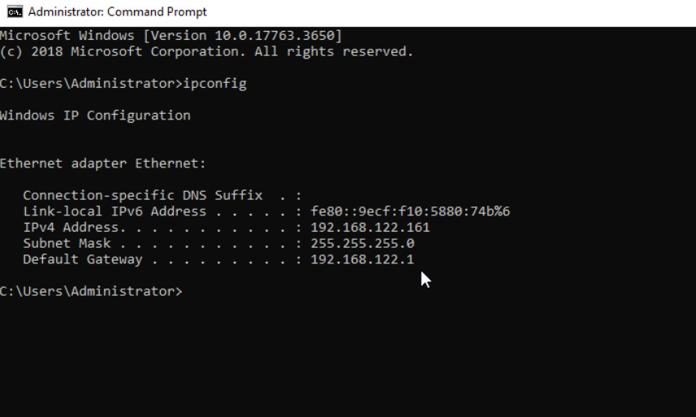

# Documento de Entrega - Desafío Firewalls Básicos

## Información del Estudiante
- **Nombre:** [Nombre del estudiante]
- **Fecha:** [Fecha de entrega]
- **Tiempo empleado:** [Tiempo real empleado]

## Descripción del Desafío
Implementación de firewalls utilizando iptables en Kali Linux para crear una configuración NAT que permita la navegación de usuarios de red interna hacia Internet y el acceso a un sitio web alojado en una DMZ.

## Arquitectura de Red Implementada

### Topología de Red
```
Internet
    |
    | (WAN)
[Kali Linux - Firewall/Gateway]
    |
    +-- Red Interna (LAN) -- [IE8-Win7]
    |
    +-- DMZ -- [Windows Server con IIS]
```

### Configuración de Interfaces de Red

#### Kali Linux (Firewall/Gateway)
- **eth0 (WAN):** 192.168.1.254/24 - Conexión a Internet
- **eth1 (LAN):** 10.0.1.1/24 - Red interna
- **eth2 (DMZ):** 172.16.1.1/24 - Zona desmilitarizada

#### IE8-Win7 (Cliente interno)
- **IP:** 10.0.1.10/24
- **Gateway:** 10.0.1.1
- **DNS:** 8.8.8.8

#### Windows Server (DMZ - Servidor Web)
- **IP:** 192.168.122.161/24
- **Gateway:** 192.168.122.1/24
- **DNS:** 8.8.8.8

---

## Requerimiento 1: Configuración de iptables para NAT (4 Puntos)

### Configuración Inicial
```bash
# Limpiar todas las reglas existentes
iptables -F
iptables -t nat -F
iptables -t mangle -F

# Establecer políticas por defecto
iptables -P INPUT DROP
iptables -P FORWARD DROP
iptables -P OUTPUT ACCEPT
```

### Configuración de NAT, IP Forwarding y Reglas Básicas


### Reglas de DNAT para acceso al servidor web
```bash
# Redirigir tráfico del puerto 80 hacia el servidor web en DMZ
iptables -t nat -A PREROUTING -i eth0 -p tcp --dport 80 -j DNAT --to-destination 172.16.1.10:80

# Permitir el tráfico hacia el servidor web desde Internet
iptables -A FORWARD -d 172.16.1.10 -p tcp --dport 80 -j ACCEPT
```

### Persistencia de reglas
```bash
# Guardar reglas en Kali Linux
iptables-save > /etc/iptables/rules.v4

# Hacer persistente el IP forwarding
echo 'net.ipv4.ip_forward=1' >> /etc/sysctl.conf
```

### Verificación de reglas
```bash
# Mostrar todas las reglas
iptables -L -n -v
iptables -t nat -L -n -v

# Verificar IP forwarding
cat /proc/sys/net/ipv4/ip_forward
```

---

## Requerimiento 2: Evidencia de navegación a Internet desde red interna (2 Puntos)

### Configuración en IE8-Win7

#### Configuración de red
1. **Panel de Control > Conexiones de red**
   - IP estática: 10.0.1.10
   - Máscara: 255.255.255.0
   - Gateway: 10.0.1.1
   - DNS: 8.8.8.8

#### Pruebas de conectividad
```cmd
# Desde IE8-Win7 (CMD)
ping 10.0.1.1          # Ping al gateway
ping 8.8.8.8           # Ping a DNS público
nslookup google.com    # Resolución DNS
```

### Evidencia de navegación
**Captura 1:** Configuración de red en IE8-Win7
- Screenshot del panel de configuración TCP/IP

**Captura 2:** Prueba de conectividad
- Screenshot de ping exitoso a gateway y DNS público
- Screenshot de nslookup funcionando

**Captura 3:** Navegación web exitosa
- Screenshot de Internet Explorer accediendo a www.google.com
- Screenshot de la página cargada completamente

**Captura 4:** Logs en Kali Linux
```bash
# Monitorear tráfico NAT
tail -f /var/log/syslog | grep iptables
# o
tcpdump -i eth0 -n host 10.0.1.10
```

---

## Requerimiento 3: Sitio web base con IIS en DMZ (2 Puntos)

### Instalación y configuración de IIS en Windows Server

#### Instalación de IIS
1. **Server Manager > Add Roles and Features**
2. **Web Server (IIS) Role**
3. **Include Management Tools**

#### Configuración del sitio web
1. **IIS Manager**
2. **Default Web Site**
3. **Crear página index.html personalizada**

### Contenido del sitio web base
```html
<!DOCTYPE html>
<html>
<head>
    <title>Servidor Web DMZ - Desafío Firewall</title>
    <style>
        body { font-family: Arial; text-align: center; margin-top: 50px; }
        .container { max-width: 600px; margin: 0 auto; }
        .info { background: #f0f0f0; padding: 20px; border-radius: 5px; }
    </style>
</head>
<body>
    <div class="container">
        <h1>🔥 Servidor Web en DMZ</h1>
        <div class="info">
            <h2>Información del Servidor</h2>
            <p><strong>IP del Servidor:</strong> 172.16.1.10</p>
            <p><strong>Zona:</strong> DMZ (Zona Desmilitarizada)</p>
            <p><strong>Servicio:</strong> IIS Web Server</p>
            <p><strong>Estado:</strong> Activo y funcionando</p>
        </div>
        <h3>✅ Desafío de Firewall completado exitosamente</h3>
        <p>Acceso desde red interna hacia DMZ configurado correctamente</p>
    </div>
</body>
</html>
```

### Configuración de red en Windows Server
```cmd
# Configuración IP estática
netsh interface ip set address "Local Area Connection" static 172.16.1.10 255.255.255.0 172.16.1.1
netsh interface ip set dns "Local Area Connection" static 8.8.8.8

# Verificar configuración
ipconfig /all
```

### Pruebas locales en Windows Server
```cmd
# Verificar que IIS esté funcionando
netstat -an | findstr :80
telnet localhost 80

# Verificar conectividad de red
ping 172.16.1.1    # Ping al gateway
ping 8.8.8.8       # Ping a Internet
```

### Evidencia del servidor web
**Captura 5:** I
- Screenshot del IIS Manager con el sitio configurado

**Captura 7:** Página web funcionando localmente
- Screenshot del navegador en Windows Server accediendo a http://localhost


**Captura 8:** Configuración de red del servidor
- Screenshot de ipconfig /all mostrando la configuración IP


---

## Requerimiento 4: Acceso desde IE8-Win7 hacia sitio web en DMZ (2 Puntos)

### Pruebas de conectividad hacia DMZ

#### Desde IE8-Win7
```cmd
# Verificar conectividad hacia la DMZ
ping 172.16.1.10
telnet 172.16.1.10 80
nslookup 172.16.1.10
```

### Acceso al sitio web desde red interna

#### Configuración del navegador
1. **Internet Explorer en IE8-Win7**
2. **Configurar proxy si es necesario (generalmente no)**
3. **Desactivar firewall de Windows temporalmente para pruebas**

#### URL de acceso
- **Directo:** http://172.16.1.10
- **Si hay DNS interno:** http://servidor-dmz.local

### Pruebas de acceso web
```cmd
# Desde IE8-Win7, verificar conectividad HTTP
telnet 172.16.1.10 80
# Luego escribir:
GET / HTTP/1.0
[Enter dos veces]
```

### Evidencia del acceso
**Captura 9:** Conectividad hacia DMZ
- Screenshot de ping exitoso desde IE8-Win7 hacia 172.16.1.10

**Captura 10:** Acceso web exitoso
- Screenshot de Internet Explorer en IE8-Win7 mostrando la página web de la DMZ
- URL visible: http://172.16.1.10

**Captura 11:** Logs de acceso en Kali Linux
```bash
# Monitorear tráfico hacia DMZ
tcpdump -i eth1 -n dst 172.16.1.10
# o ver logs de iptables si están configurados
tail -f /var/log/kern.log | grep iptables
```

**Captura 12:** Logs de IIS en Windows Server
- Screenshot de los logs de IIS mostrando las peticiones desde 10.0.1.10

---

## Verificación Final y Troubleshooting

### Comandos de verificación en Kali Linux
```bash
# Verificar estado de las interfaces
ip addr show

# Verificar tabla de routing
ip route show

# Verificar reglas de iptables activas
iptables -L -n -v --line-numbers
iptables -t nat -L -n -v --line-numbers

# Verificar conexiones activas
netstat -tuln

# Monitorear tráfico en tiempo real
tcpdump -i any -n icmp
tcpdump -i any -n port 80
```

### Solución de problemas comunes

#### Problema: No hay conectividad a Internet
```bash
# Verificar IP forwarding
cat /proc/sys/net/ipv4/ip_forward  # Debe ser 1

# Verificar reglas NAT
iptables -t nat -L POSTROUTING -n -v

# Verificar conectividad desde el firewall
ping -I eth0 8.8.8.8
```

#### Problema: No se puede acceder al sitio web en DMZ
```bash
# Verificar reglas de FORWARD
iptables -L FORWARD -n -v

# Verificar que el servicio esté corriendo en Windows Server
# Desde Windows Server CMD:
netstat -an | findstr :80
```

### Logs y monitoreo
```bash
# Habilitar logging de iptables (opcional)
iptables -I FORWARD -j LOG --log-prefix "FIREWALL-FORWARD: "
iptables -I INPUT -j LOG --log-prefix "FIREWALL-INPUT: "

# Ver logs
tail -f /var/log/kern.log | grep FIREWALL
```

---

## Conclusiones

### Objetivos cumplidos
✅ **Configuración NAT:** Se implementaron correctamente todas las reglas de iptables para NAT
✅ **Navegación a Internet:** Los usuarios de la red interna pueden navegar hacia Internet
✅ **Servidor web DMZ:** Se levantó exitosamente un sitio web con IIS en la DMZ
✅ **Acceso interno a DMZ:** El equipo IE8-Win7 puede acceder al sitio web de la DMZ

### Configuración de seguridad implementada
- **Segmentación de red:** Red interna, DMZ e Internet están adecuadamente separadas
- **Control de acceso:** La DMZ no puede acceder a la red interna
- **NAT configurado:** Oculta las direcciones IP internas
- **Firewall stateful:** Solo permite conexiones establecidas de vuelta

### Aprendizajes obtenidos
1. **Configuración de iptables:** Comprensión de las cadenas INPUT, FORWARD y OUTPUT
2. **NAT y MASQUERADE:** Implementación de traducción de direcciones
3. **Segmentación de redes:** Separación adecuada de zonas de seguridad
4. **Troubleshooting:** Resolución de problemas de conectividad

### Tiempo empleado
**Total:** [X] minutos (dentro del límite de 60 minutos)

---
